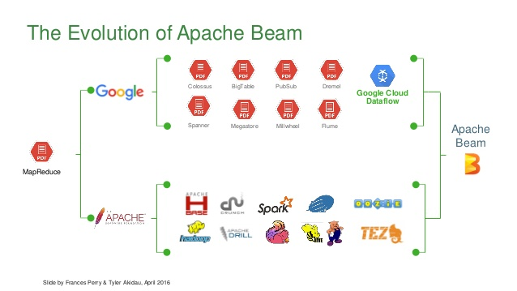
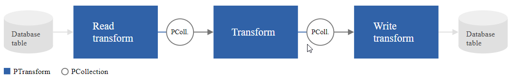

# Apache Beam

- Resources:
- https://beam.apache.org/get-started/resources/learning-resources/#courses
- Coursera: https://www.coursera.org/specializations/serverless-data-processing-with-dataflow
  
It is one of the latest open source project of Apache. It is an unified programming model for expressing efficient & portable Big Data processing pipeline.
```
Batch + Stream = Beam
```
## Overview of Apache Beam:
<p align="center">
  
</p>

## Advantages of Beam:
- Unified:
It has one unified API to process both batch & streaming data.
- Portable:
Beam pipeline once created, can be run in any language and on any execution framework like Spark, Flink, Google Cloudflow etc.

## Evolution of Apache Beam:
<p align="center">
  
</p>

## Beam Architecture:
<p align="center">
  
</p>

## Flow of Beam programming model:
<p align="center">
  
</p>

## Basic Beam Terminologies:
- Pipeline:
  - A pipeline encapsulates entire data processing task from start to finish.
  - It includes reading input data, transforming data and then outputing the data.
- PCollection:
  - A PCollection is equivalent to the RDD of Spark.
  - It represents a distributed data set that out Beam pipeline operates on.
- PTransform:
  - PTransform represents a data processing operation step in our pipeline.
  - For example: ParDo, filter, flatten, Combine, etc.

## Installation:
```
pip3 install apache_beam
```
## Sample Beam Program:
```
import apache_beam as beam

p1 = beam.Pipeline()                                        # Beam Pipeline initialized
attendance_count= (
    p1 
    | beam.io.ReadFromText('data.txt')                       # Reading a text file!
    | beam.Map(lambda record: record.split(','))             # Transformation on PCollection (Applying Map)
    | beam.Filter(lambda record: record[3]=='Accounts')      # Transformation on PCollection (Filtering records)
    | beam.CombinePerKey(sum)                                # Transformation on PCollection (Reducing + Combining)
    | beam.WriteToText('data/output')                        # Writing the PCollection in a text file!

)
p1.run()                                                     # Running the Beam pipeline

```
