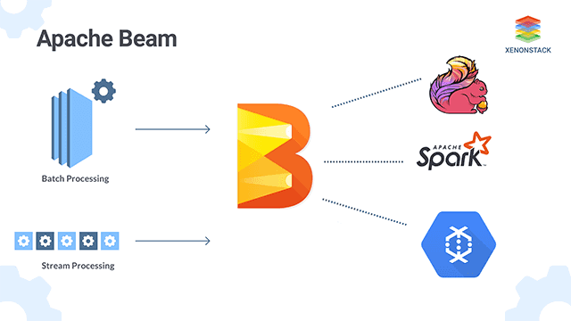
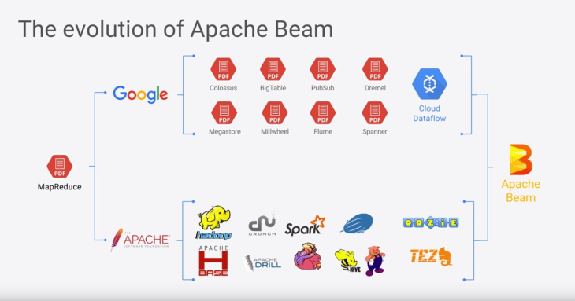
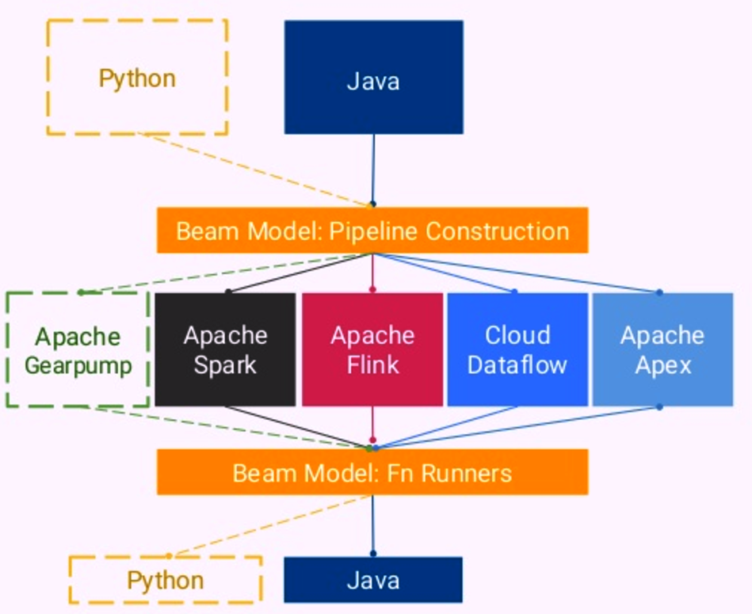

# ApacheBeam
It is one of the latest open source project of Apache. It is an unified programming model for expressing efficient & portable Big Data processing pipeline.
```
Batch + Stream = Beam
```
## Overview of Apache Beam:
<p align="center">
  
</p>

## Advantages of Beam:
- Unified:
It has one unified API to process both batch & streaming data.
- Portable:
Beam pipeline once created, can be run in any language and on any execution framework like Spark, Flink, Google Cloudflow etc.

## Evolution of Big Data Framework:
<p align="center">
  
</p>

## Beam Architecture:
<p align="center">
  
</p>

